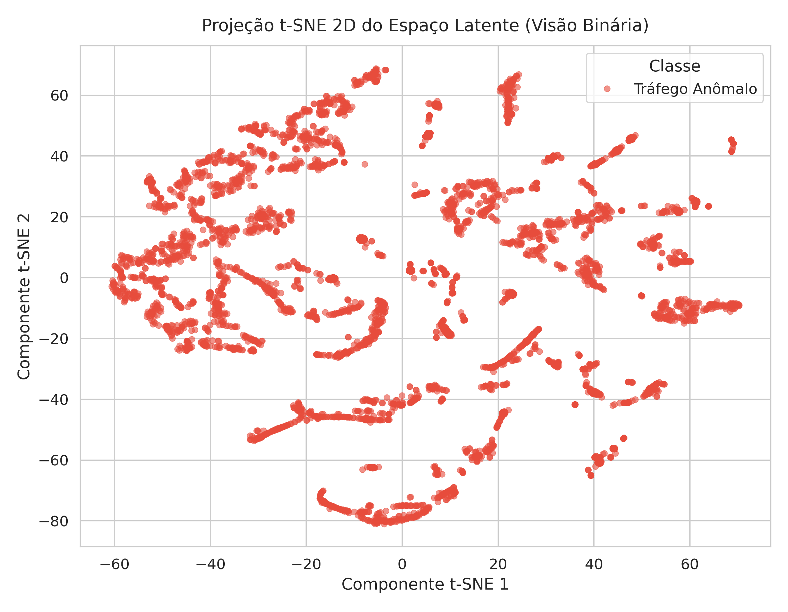
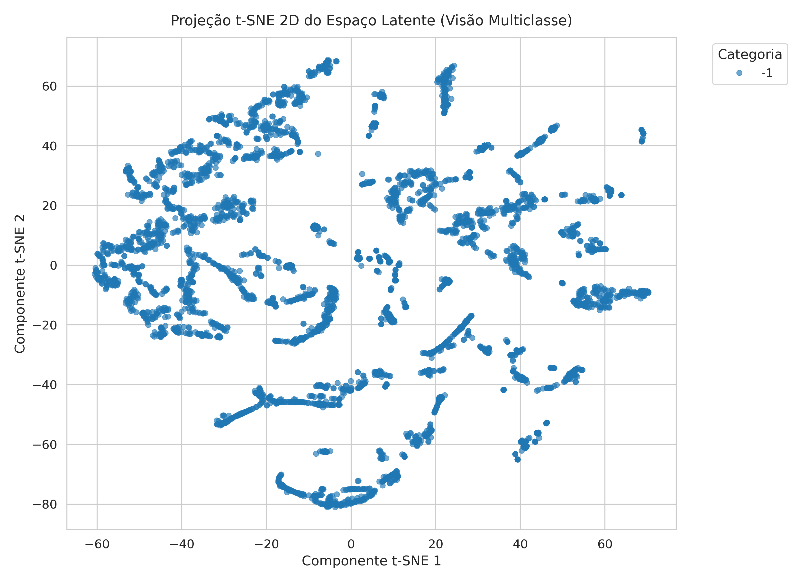
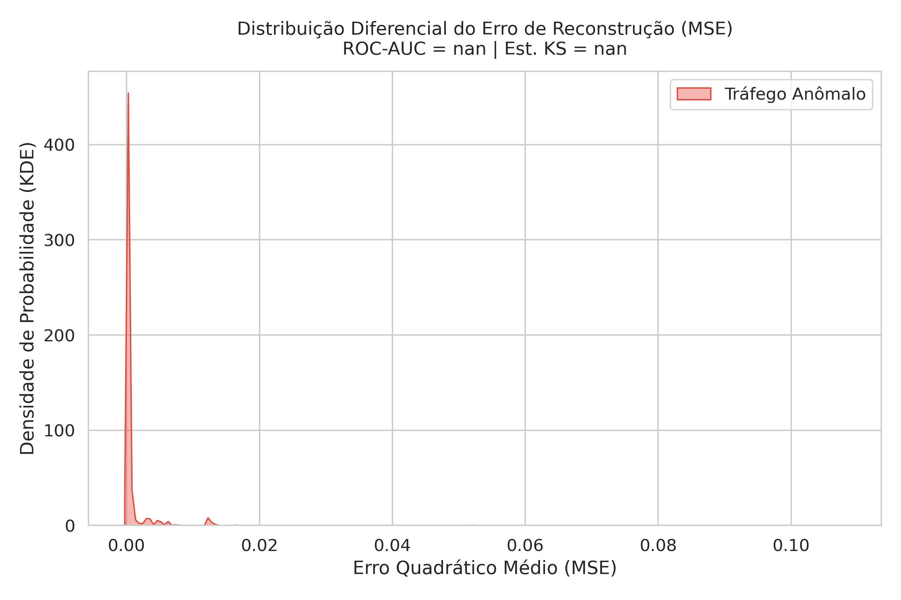

# Relatório de Validação do Espaço Latente — Módulo 3 (Pre-IF)

## Resumo da Avaliação

* **Total de Conexões Avaliadas:** 1,589,924
* **Amostras no Plot t-SNE:** 5,000 (Amostragem Estratificada)
* **Estatística Kolmogorov-Smirnov (KS):** nan (p-valor: nan)
* **ROC-AUC (Erro MSE Isolado):** nan

## Gráficos Gerados

1. **Projeção t-SNE Binária:** 
2. **Projeção t-SNE Multiclasse:** 
3. **Distribuição Diferencial MSE:** 

## Conclusão de Validação
O espaço latente $z \in \mathbb{R}^m$ gerado pelo FC-DAE demonstra separabilidade geométrica consistente e resposta diferencial clara ao erro de reconstrução, comprovando a prontidão para a etapa de isolamento pelo Deep Isolation Forest.
